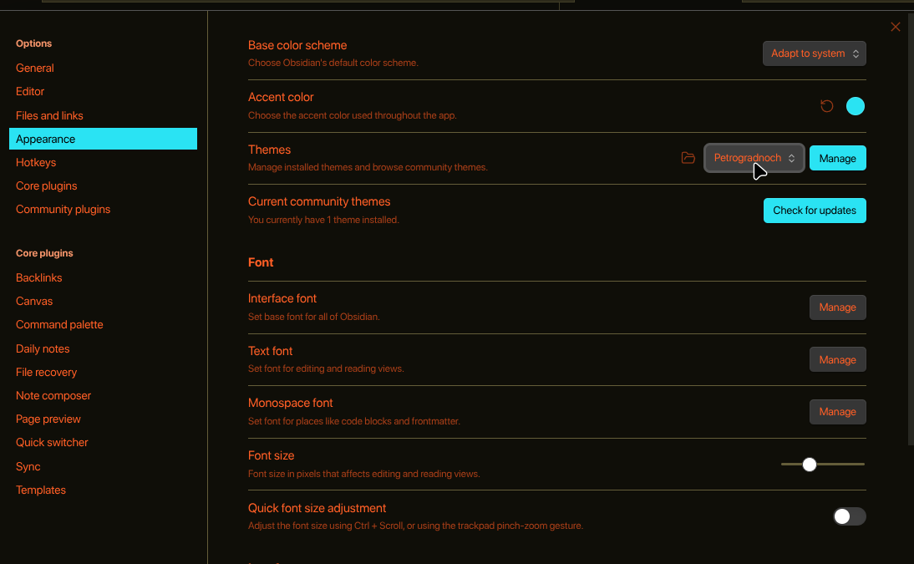

# Petrogradnoch theme for Obsidian
This is a [Petrogradnoch](https://github.com/Andrey0189/herbstluftwm-petrogradnoch) theme for [Obsidian](https://obsidian.md/).

## Installation

1. Open the terminal and change the directory to the `themes` directory.
   ~~~
   cd path/to/vault/.obsidian/themes
   ~~~
2. Clone the repository using Git.
   ~~~
   git clone https://github.com/voluntasest/obsidian-petrogradnoch "Petrogradnoch"
   ~~~
3. Enable the theme in Obsidian

  
